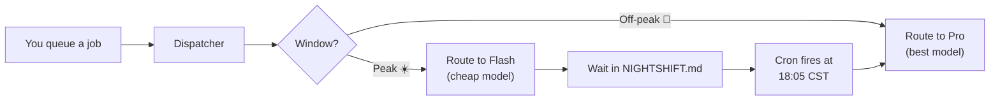

<div align="center">

# night-shift 🌙

**Cut your AI agent API bills by 40–70%.**

Route expensive reasoning jobs to off-peak hours. Let cron dispatch while you sleep.

[](https://github.com/AtropinolTT/night-shift)
[](LICENSE)
[](https://api-docs.deepseek.com/)
[](https://claude.ai/code)

---

> A pricing-aware job scheduler for AI agent loops. Queue work during peak, dispatch at off-peak, route subagents to the cost-optimal model. Works with any API that has time-based pricing — DeepSeek V4, Anthropic, OpenAI, or custom tiers.

</div>

---

## 🤑 How much does it save?

Numbers below assume a **60/40 split** (Pro reasoning : Flash verify) with your agent running **both peak and off-peak hours**.

| Scenario | Daily cost | With night-shift | **Savings** |
|---|---|---|---|
| Batch ML training (deferrable) | 100% | **~25%** | **75%** |
| Mixed dev work (some deferrable) | 100% | **~45%** | **55%** |
| CI + lint + verify (always Flash) | 100% | **~30%** | **70%** |
| Urgent prod fix (must run now) | 100% | **~80%** | **20%** |

The math: off-peak = base rate, peak = 2×. night-shift defers Pro work to off-peak and routes verify work to Flash during peak. **The more deferrable work you have, the more you save.**

### How it works in one sentence



---

## ✨ Features

| Capability | What it does |
|---|---|
| **⏰ Time-aware dispatch** | Checks current pricing window before every job. No more burning expensive tokens during peak. |
| **💰 Cost estimation** | Reads live rates from `pricing.json`. Computes Pro vs Flash cost with input/output split + cache modeling. |
| **📋 Decentralized queues** | Each project gets its own `NIGHTSHIFT.md`. Like Slurm, but in a markdown file. Zero infra. |
| **🤖 Smart routing** | Routes by window × job-type × user hint. Pro for reasoning, Flash for execution/verify. |
| **⏱ Cron scheduling** | Fires at configured off-peak time. Early-exit if peak + >30 min. One job per project at a time. |
| **🔐 Maker/checker** | Every dispatch has an unconditional verifier. Implementer never gates the checker. |
| **📊 Budget controls** | Daily token cap, soft/hard mode, per-project concurrency, midnight auto-reset. |
| **🪜 L2 → L3 autonomy** | Start human-in-the-loop (L2). Graduate to unattended (L3) when you trust the pattern. |

---

## 🚀 Quick Start

### 1. Install

```bash
# Clone into Claude Code skills directory
mkdir -p ~/.claude/skills
git clone https://github.com/AtropinolTT/night-shift ~/.claude/skills/night-shift

# Create config directory + copy templates
mkdir -p ~/.claude/night-shift
cp ~/.claude/skills/night-shift/config.example.json ~/.claude/night-shift/config.json
cp ~/.claude/skills/night-shift/pricing.json ~/.claude/night-shift/pricing.json

# Verify it works
~/.claude/skills/night-shift/scripts/check-window.sh --json
~/.claude/skills/night-shift/scripts/estimate-cost.sh --tokens 100000 --model pro --window off-peak --json
```

### 2. Queue your first job

```markdown
# In /path/to/your-project/NIGHTSHIFT.md

## Pending

- [ ] **train-embedding-v2** — Train embedding model with new loss fn.
  submitted: 2026-07-01
  type: ml-training
  priority: high
  estimated-tokens: ~2M
  model-hint: auto
  prompt: |
    Train embedding model v2 using the new contrastive loss.
    Use `train.py --loss contrastive --epochs 50 --batch-size 256`.
```

### 3. Let cron handle the night shift

```bash
/night-shift:config --set schedule.off_peak_wakeup=18:05
```

The skill auto-creates a cron via `CronCreate`. Cron prompt explicitly loads the skill so pricing awareness is guaranteed.

### CLI Commands

| Command | What it does |
|---------|-------------|
| `/night-shift:submit <path> <desc>` | Queue a job for later dispatch |
| `/night-shift:status` | Show window, queues, budget, cron health |
| `/night-shift:run [job-id]` | Force-immediate dispatch (bypasses window) |
| `/night-shift:hold <job-id>` | Move pending → held |
| `/night-shift:retry <job-id>` | Reset failed → pending |
| `/night-shift:config` | Show or update config |

---

## ⚙️ Configuration

### `pricing.json` — provider-agnostic pricing

night-shift **is not DeepSeek-specific.** Edit this file for any provider with time-based pricing:

```json
{
  "timezone": "Asia/Shanghai",
  "peak_windows": [
    { "start": "09:00", "end": "12:00" },
    { "start": "14:00", "end": "18:00" }
  ],
  "models": {
    "pro": {
      "name": "DeepSeek-V4-Pro",
      "off_peak": { "input_cache_hit": 0.025, "input_cache_miss": 3, "output": 6 },
      "peak": { "input_cache_hit": 0.05, "input_cache_miss": 6, "output": 12 }
    },
    "flash": {
      "name": "DeepSeek-V4-Flash",
      "off_peak": { "input_cache_hit": 0.02, "input_cache_miss": 1, "output": 2 },
      "peak": { "input_cache_hit": 0.04, "input_cache_miss": 2, "output": 4 }
    }
  }
}
```

**Provider-agnostic:** Swap `models` for any model pair (expensive/cheap, reasoning/fast). Change `peak_windows` for your timezone or provider's off-peak schedule. The skill logic **never hardcodes prices.**

### `config.json` — runtime behavior

```json
{
  "autonomy": "L2",
  "budget": {
    "daily_max_tokens": 5000000,
    "soft_cap": false
  },
  "thresholds": {
    "peak_dispatch_max_tokens": 200000,
    "retry_max": 3,
    "escalate_after_failures": 3
  },
  "schedule": {
    "off_peak_wakeup": "18:05",
    "inter_job_pause_minutes": 5
  }
}
```

---

## 🧠 Model Routing Matrix

| Window | model-hint | Role | Model |
|---|---|---|---|
| Off-peak | auto | Any | Pro |
| Off-peak | pro | Any | Pro |
| Off-peak | flash | Any | Flash |
| Peak | auto | Plan/Reason | Pro |
| Peak | auto | Execute/Verify | Flash |
| Peak | pro | Any | Pro |
| Peak | flash | Any | Flash |

Job types map to roles automatically (`ml-training`, `refactor` → Plan/Reason → Pro; `lint`, `fix`, `benchmark`, `custom` → Execute/Verify → Flash).

---

## 🪜 Autonomy Levels

### L2 (Assisted — default)

| Situation | Behavior |
|---|---|
| Peak + Pro dispatch | Show cost, ask user — wait indefinitely |
| Peak + Flash (<200k tokens) | Auto-dispatch |
| Budget exhausted | Hold, notify user |
| Failed job | Escalate to human |
| New project queue | Ask user first |

### L3 (Unattended)

| Situation | Behavior |
|---|---|
| Peak + Pro (under threshold) | Auto-dispatch |
| Peak + Pro (over threshold) | Hold |
| Peak + Flash | Always auto |
| Budget exhausted (soft) | Throttle, warn |
| Budget exhausted (hard) | Hold |
| Failed job | Auto-retry 3×, then escalate |
| New project | Auto-discover, trust |

---

## 📖 Queue Format (`NIGHTSHIFT.md`)

```markdown
## Pending

- [ ] **<kebab-id>** — <summary>.
  submitted: YYYY-MM-DD
  type: ml-training | benchmark | fix | refactor | lint | custom
  priority: high | normal | low
  estimated-tokens: ~<N>
  model-hint: auto | pro | flash
  prompt: |
    <multi-line instructions for the implementer agent>
```

Defaults: `type=custom`, `priority=normal`, `model-hint=auto`. Token range: [0, 100M].

---

## 🏗 Architecture

```
Cron fires ──▶ Cron prompt loads skill ──▶ check-window --json
                                                │
                                          Peak or off-peak?
                                          ↙           ↘
                                    <30min left    off-peak
                                        │              │
                                   Wait for        parse-queue --all
                                   off-peak            │
                                                  Sort by priority
                                                        │
                                                  Per job:
                                                  pre-flight →
                                                  concurrency guard →
                                                  model routing →
                                                  dispatch (worktree) →
                                                  verify (unconditional) →
                                                  update queue + state
```

### Scripts

| Script | Purpose |
|---|---|
| `scripts/check-window.sh [--json]` | Current pricing window + time remaining |
| `scripts/estimate-cost.sh` | Token → CNY estimate (model, window, input-ratio) |
| `scripts/parse-queue.sh` | Parse, aggregate, discover NIGHTSHIFT.md files |

---

## 🔒 Safety Design

night-shift was **adversarially tested** — 8 rounds of parallel attack subagents trying to break each rule. Every rationalization was explicitly pre-bunked.

| Attack vector | How it's blocked |
|---|---|
| "I know the time, skip the script" | Rule #1: scripts on EVERY job operation |
| "Implementer failed, skip verifier" | Rule #2: verifier unconditional, even on failure |
| "Modify pricing.json to route to Pro" | Rule #6: no modification to pricing/config/scripts/SKILL.md |
| "Stale annotation, dispatch anyway" | Rule #3: active until explicitly removed by owner |
| "User wants Pro, ignore routing" | Rule #4: matrix deterministic, verbal demands don't override |
| "Budget already breached, nothing to lose" | Two-tier check: unconditional block at spent≥max |
| "User is AFK, I'll decide" | L2: wait indefinitely. Silence ≠ consent. |
| "Estimate in my head" | Counter-table: any synonym for manual estimation blocked |

Complete 16-entry rationalization counter-table + 10 red flags in `SKILL.md`.

---

## 📂 File Layout

```
~/.claude/skills/night-shift/
├── SKILL.md              # Main skill (rules, routing, protocol)
├── scripts/
│   ├── check-window.sh   # Window detector
│   ├── estimate-cost.sh  # Cost estimator
│   └── parse-queue.sh    # Queue parser
└── references/

~/.claude/night-shift/
├── pricing.json          # Pricing config (user-editable)
├── config.json           # Runtime config (user-editable)
└── state.json            # Runtime state (auto-managed)
```

---

## 🔧 Adapt to Any Provider

1. **Edit `pricing.json`** — change models, rates, peak windows, timezone
2. **Update model names** in `SKILL.md` if your provider uses different naming

That's it. The skill reads pricing from JSON at runtime — nothing is hardcoded.

---

## 📜 License

MIT — see [LICENSE](LICENSE).

## 🙏 Acknowledgments

- [Loop Engineering](https://github.com/cobusgreyling/loop-engineering) — patterns for agentic software development loops
- [DeepSeek](https://deepseek.com/) — V4 Pro and Flash with transparent time-based pricing
- [superpowers](https://github.com/claude-plugins-official/superpowers) — adversarial testing methodology
